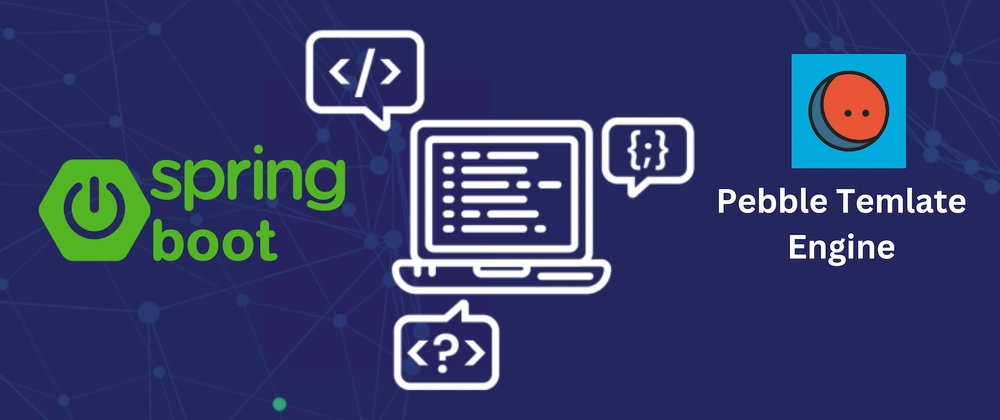

- [Desarrollo Web en Entornos Servidor - 03 - Spring Boot y Pebble](#desarrollo-web-en-entornos-servidor---03---spring-boot-y-pebble)
  - [Contenido en YouTube](#contenido-en-youtube)
  - [Contenido](#contenido)
  - [Proyecto](#proyecto)
 
# Desarrollo Web en Entornos Servidor - 03 - Spring Boot y Pebble

Tema 03. Desarrollo de páginas web dinámicas en JVM. 2DAW. Curso 2026-2027.

## Contenido en YouTube

- [Podcast](https://youtu.be/8eyjLtFz55I)
- [Resumen](https://youtu.be/4rako8IXxGc)
- [Manejo de Formularios](https://youtu.be/Lto449XDyUM)
- [Motor de Plantillas Pebble](https://youtu.be/FMm2BEVjOoY)
- [Gestión de Datos Globales, Estado y Seguridad](https://youtu.be/3W_vNbM94Hs)
- [Lista de Reproducción](https://www.youtube.com/watch?v=tlRgLmopS1g&list=PLGIH-7eZDbVzq51Vk4XHAgQ4fTHZVTLRl)

## Contenido
1. [Fundamentos](./01-fundamentos.md) - Generación dinámica, arquitectura MVC, flujo de petición
2. [Pebble Templates](./02-pebble.md) - Sintaxis, variables, condicionales, bucles, herencia, macros, filtros
3. [Controladores y Formularios](./03-controladores-formularios.md) - @Controller, Model, formularios, validación, patrón PRG
4. [Estado y Seguridad](./04-estado-seguridad.md) - Sesiones, cookies, Spring Security, CSRF, @ControllerAdvice
5. [Tecnologías Híbridas](./05-tecnologias-hibridas.md) - AJAX, REST, @RestController, funcionalidades avanzadas
6. [Pruebas](./06-pruebas.md) - Tests unitarios, MockMvc, integración
7. [Configuración y Despliegue](./07-configuracion-despliegue.md) - Perfiles, variables de entorno, Docker
8. [Casos Avanzados](./08-casos-avanzados.md) - GlobalControllerAdvice, email asíncrono, PDFs
9. [Resumen](./09-resumen.md) - Resumen ejecutivo, mapa mental, checklist

## Proyecto

El proyecto realizado en clase podrás seguirlo desde el repositorio de GitHub:
- [Proyecto](https://github.com/joseluisgs/WalaDawWeb-SpringBoot)
