## Primer proyecto InteliJ con control de versiones
- Una vez instalado InteliJ lo ejecutamos y nos saldra la siguiente pantalla donde seleccionaremos Customize

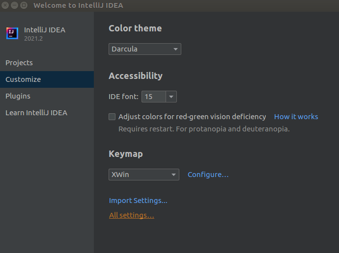

- Nos vamos a la sección Git y si hemos instalado correctamente git en nuestro sistema podemos darle al boton Test

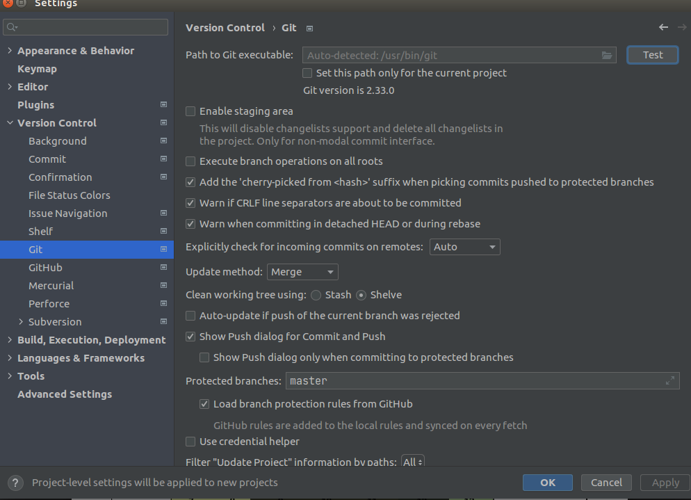

- Una vez realizadas las comprobaciones pasamos a integrar nuestra cuenta de Github en la sección Github y añadiendo nuestra cuenta

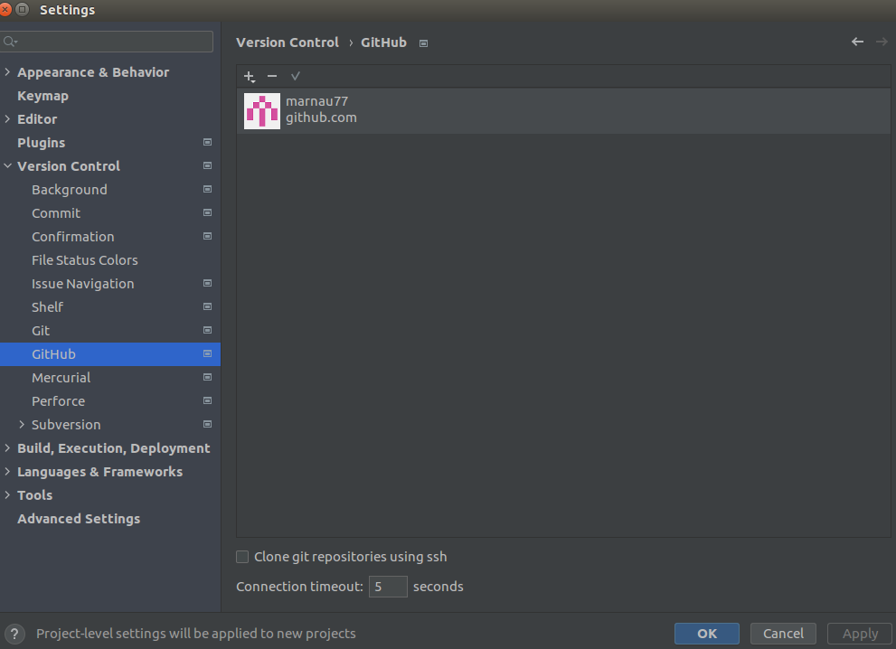

- Nos pedira autorizar a que el Ide pueda acceder a nuestra cuenta de Github, 

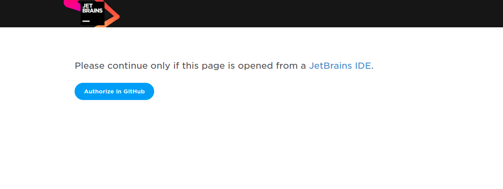

- Autorizamos
 
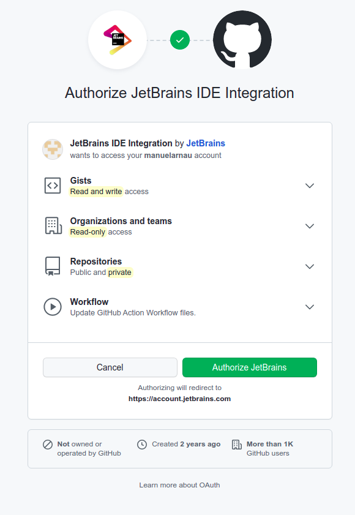

- Confirmamos password

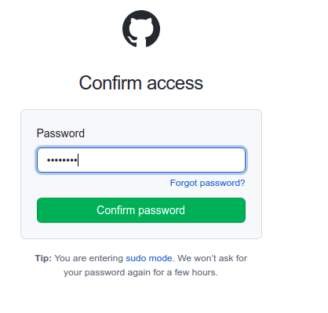

## Creando el proyecto proyectos integrado con Github

- Creamos un nuevo proyecto (Recordad que IntelliJ nos permite poner varios subproyectos dentro de un proyecto y será este único proyecto en el que mantendremos todas las prácticas del módulo)

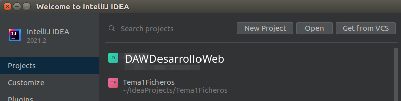

- Nos aparecerá el jdk instalado en nuestro sistema o bien el que lleva integrado IntelliJ
- Intentaremos utilizar versiones LTS 8,11,17,21,25 según el proyecto o módulo que implementemos
- Intentaremos coger las implementaciones de Oracle aunque tenemos una versión descargable desde el IDE de Oracle más ligera
- Descargaremos y utilizaremos de forma general graalvm-jdk-21 aunque para algún módulo establezcamos otra.

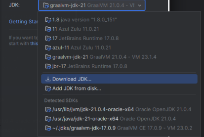

- Proseguimos creando el proyecto.

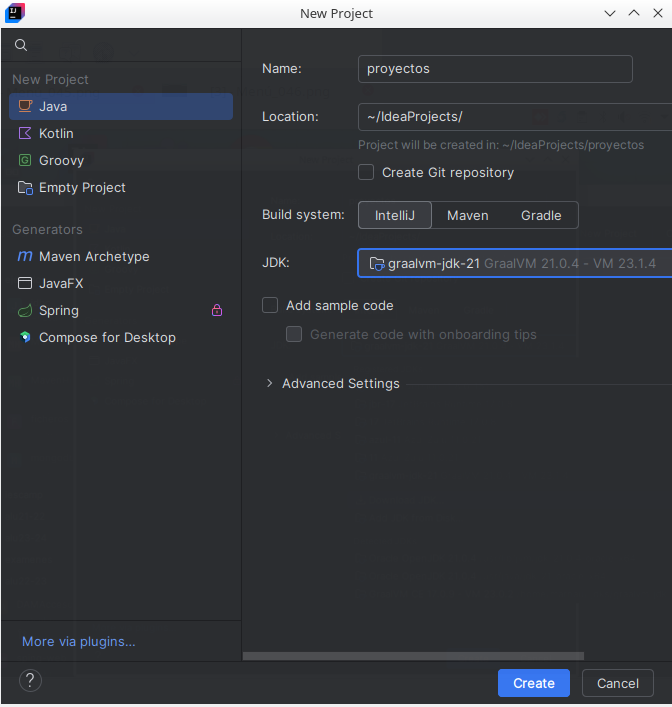

-Tomamos el template básico  y le ponemos el nombre proyectos

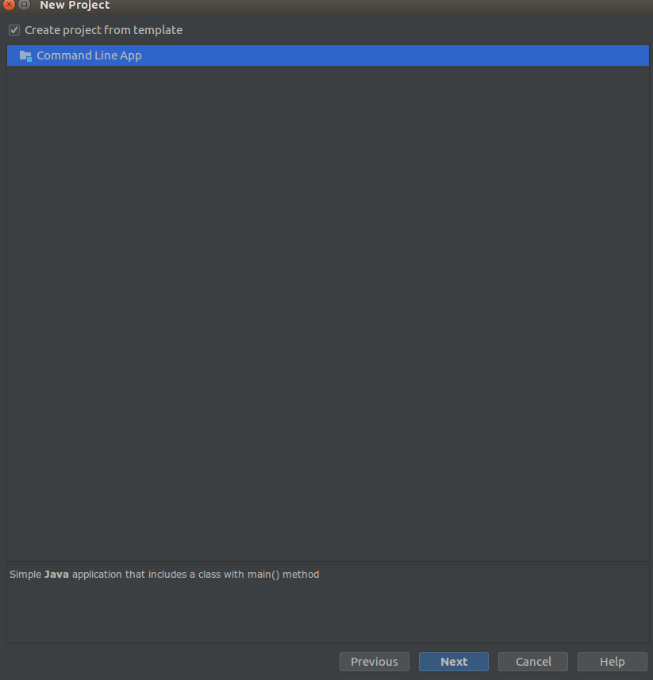

- Nos abrá creado la estructura básica del proyecto
 
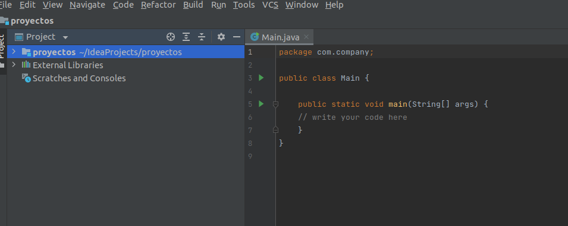
 
- Nos vamos a la opcion VCS (Control de versiones y habilitamos la integración con el control de versiones para el proyecto

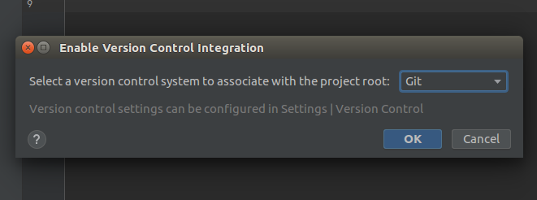

- Una vez habilitado en la sección del Git compartimos el proyecto en Github de forma privada
 
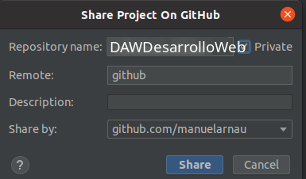

- Hacemos el primer commit, aunque lo habitual es excluir con un .ignore los archivos propios del entorno local utilizado en el desarrollo en este caso añadiendo todos los ficheros del proyecto al igual que su configuración para comprobar la correcta configuración
 
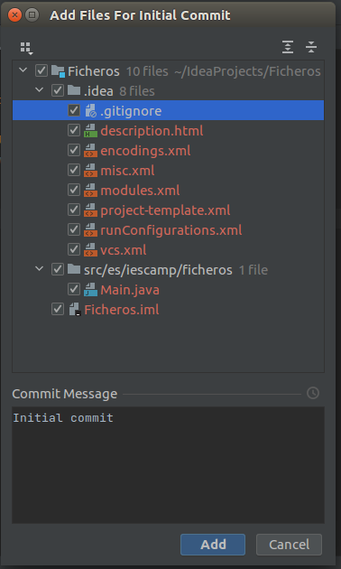

- Si todo ha ido bien debe sacarnos el siguiente mensaje 
 

- Si nos vamos a nuesta cuenta de Github debe habernos creado el repositorio privado 
 
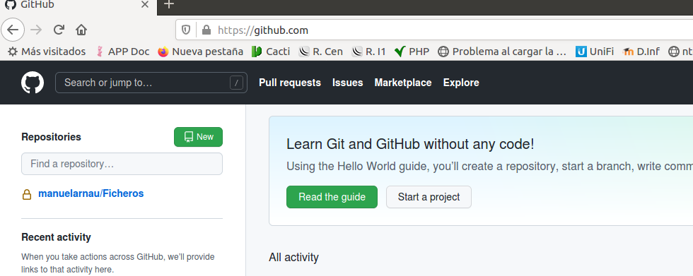

- Al hacer click sobre el nos aparecerá el repositorio con nuestro código
 
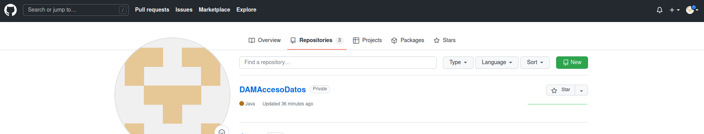

- Solo nos queda poner de colaborador a nuestro profesor a la cuenta que os solicite para que pueda ver o modificar el código. Hacemos click en settings
 
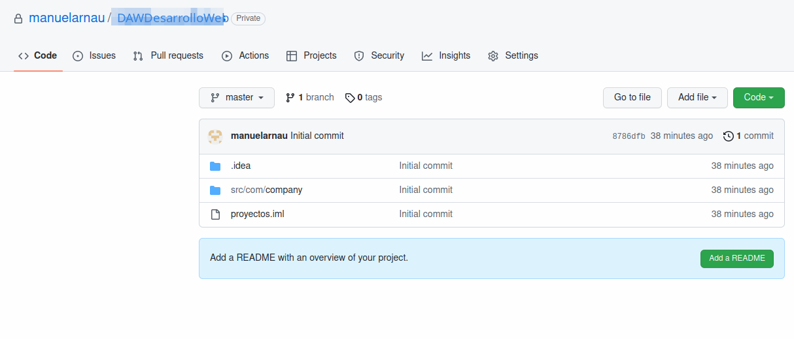

- Accedemos a Manage Access e invitamos a nuestro profesor ( m.arnauhuerta@edu.gva.es)
 
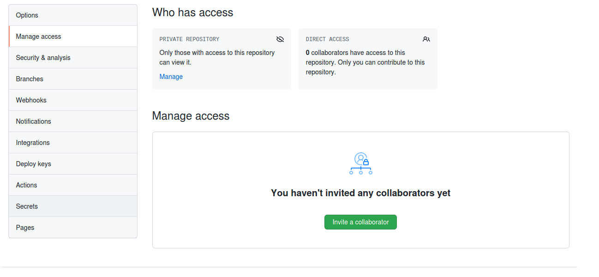

